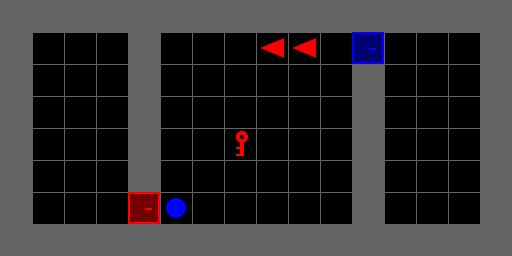
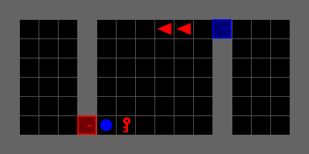
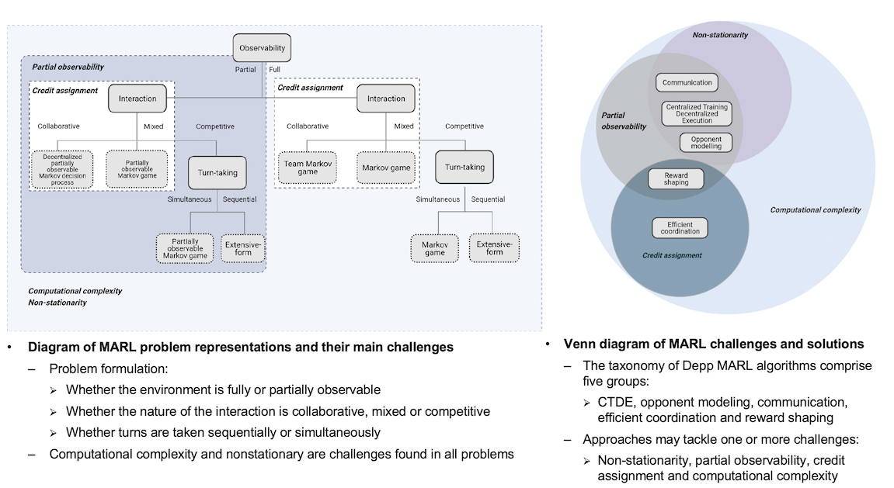
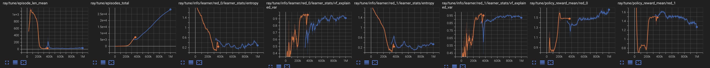
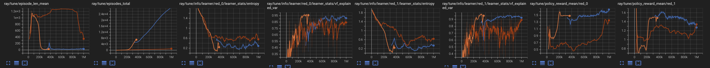
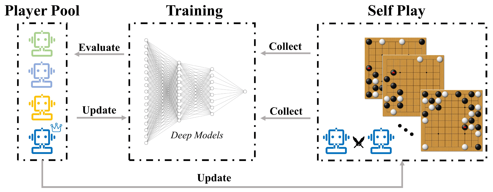

---

# Assignment 3: Apply MARL Techniques for Multi-Agent Stochastic Games

## Due Date
- **Deadline:** Thursday, September 28, 9:00 PM

## Overview
Embark on a journey to unravel the complexities of Multi-Agent Stochastic Tasks in this assignment. It's designed as a practical, hands-on exploration into the world of Multi-Agent Reinforcement Learning (MARL). Bridge the gap between theoretical concepts and practical solutions, providing you with the essential knowledge and tools to navigate the intricate landscape of MARL problems. Upon completion, you’ll be adept in:

- **Understanding Three Key Multi-Agent Training Schemes:**
  - **Decentralized Training with Decentralized Execution (DTDE)**: Independent training & execution per agent without central coordination
  - **Centralized Training with Decentralized Execution (CTDE)**: Central training for joint policies, but agents act independently in execution
  - **Centralized Training with Centralized Execution (CTCE)**: Teams of homogeneous agents share policy, rewards, and parameters
  
- **Navigating Various Game Models in Collaborative and Competitive Tasks:**
  - **Collaborative Task:**
    - Engage in decentralized partially-observable identical-interest stochastic potential games, learning coordination for sub-task contribution to team objectives.
  - **Competitive Task:**
    - Master 1v1 decentralized partially-observable zero-sum stochastic games and 2v2 centralized partially-observable general-sum stochastic team games.

- **Applied Advanced Deep RL Mechanics with RLlib:**
  - Transfer "skills" or neural network parameters from limited world dynamics scenarios to more random ones.
  - Craft a customized Torch PPO Policy for parameter sharing during training and independent execution during deployment (CTDE).
  - Implement the Policy Self-Play Callback Function, train your main agent by playing against a pool of its legacy versions.
  
- **Participating in the STR MARL CUP (1v1):**
  - Apply your comprehensive learning to customize and fine-tune your agent, gearing up for a friendly competition in the STR MARL CUP (1v1).

Be prepared to delve deep and tackle real-world MARL challenges, armed with a robust set of skills and insights. Access the starter code for this enriching assignment [here](https://classroom.github.com/a/flIqv1Tb). Immerse yourself in the world of MARL and emerge proficient and prepared for future endeavors!
The starter code for this assignment can be found [here](https://classroom.github.com/a/oexUimnn).


## Setup Instructions
Choose to run the code on either Google Colab or your local machine:
- **Local Setup**: For local execution, install the necessary Python packages by following the [INSTALLATION.md](INSTALLATION.md) guidelines.
- **Google Colab**: To run on Colab, the notebook will handle dependency installations. Try it by clicking below:  
  [](____________)

## Recommended Steps to Get Familiar with the new Code
We recommend reading the files in the following order. For some files, you will need to fill in the sections labeled `HW3 TODO` or `HW3 FIXME`.

- [multigrid/agents_pool](multigrid/agents_pool) # New✨ 
- [multigrid/rllib/ctde_torch_policy.py](multigrid/rllib/ctde_torch_policy.py) # New✨ 
- [MARLCompetativeRedBlueDoorWrapper](multigrid/wrappers.py) in `multigrid/wrappers.py` # New✨ 
- [SelfPlayCallback](multigrid/utils/training_utilis.py) in `multigrid/utils/training_utilis.py`  # New✨ 
- [submission/configs/training_config.json](submission/configs/training_config.json) # New✨
- [submission/configs/evaluation_config.json](submission/configs/evaluation_config.json)  # New✨
- [scripts/train.py](multigrid/scripts/train.py) & [multigrid/utils/training_utilis.py](multigrid/utils/training_utilis.py )  # Take a look at the new options


Look for sections marked with `HW3` to understand how your changes will be utilized. You might also find the following files relevant:

- [scripts/manual_control.py](multigrid/scripts/manual_control.py)
- [scripts/visualize.py](multigrid/scripts/visualize.py)


Depending on your chosen setup, refer to [scripts/train.py](multigrid/scripts/train.py) and [scripts/visualize.py](multigrid/scripts/visualize.py) (if running locally), or [notebooks/homework3.ipynb](notebooks/homework3.ipynb) (if running on Colab).


If you're debugging, you might want to use VSCode's debugger. If you're running on Colab, adjust the `#@params` in the `Args` class as per the command-line arguments when running locally.

If you need more compute resource for the competition, please contact the instructor.

---
# Assignment Task Breakdown

## Task 0 - Own Your Assignment By Configuring Submission Settings
- Please change the `name` in [submission_config.json](submission/submission_config.json) to your name in CamelCase
- Please tag your codebase with new release v3.1 

  Git tagging command:
  ```sheel
  git tag -a v3.1 -m "Baseline 3.1"
  ```

---
## Task 1 - Enable Centralized Training with Centralized Execution(CTCE) with CentralizedCritic and TorchCentralizedCriticModel

In this task, you will complete the implementation of PPO `CentralizedCritic` to train your CTDE agents to solve a collaborative task involving three sub-tasks: grabbing the Red key, removing the Blue Ball blocking the Red door, and unlocking the Red door with the Red key.

Unlike what we have seen before, we will train our agents to generalize to the random placements of the Red key.

<figure style="text-align: center;">
    
    <figcaption style="text-align: center;">Trained CTDE agents without Randomness</figcaption>
</figure>

<figure style="text-align: center;">
    
    <figcaption style="text-align: center;">Zero-shot Testing with Randomness</figcaption>
</figure>


To complete your implementation, identify the `HW3 - TODOs` within [multigrid/rllib/ctde_torch_policy.py](multigrid/rllib/ctde_torch_policy.py) and fill in the necessary sections.

> **Heads Up!**: This implementation of CentralizedCritic and TorchCentralizedCriticModel is modified on top of RLLib's official [examples](https://github.com/ray-project/ray/blob/master/rllib/examples/centralized_critic.py). 


#### Tips:
- For more insights, take a look at RLlib's official documentation on [Implementing a Centralized Critic](https://docs.ray.io/en/latest/rllib/rllib-env.html#implementing-a-centralized-critic).


---
## Task 2 - Solving the Decentralized Partially-Observable Identical-Interest MDP with your CTDE Agents


**Reflection Question**: Why are we using Centralized Training with Decentralized Execution (CTDE)?  

<figure style="text-align: center;">
    
    <figcaption style="text-align: center;">MARL Challenges and Solutions Mapping Diagrams</figcaption>
</figure>

In Class, we learned a few frameworks for mapping MARL solutions to problems. For our Decentralized-POMDP collaborative task, we anticipate challenges like partial observability and non-stationarity, and possibly the Credit Assignment problem with entirely disjoint agents.

Thus, we are using CTDE. This method centrally trains a joint policy considering all agents' actions and observations. At deployment, each agent, following its own policy derived from centralized training. Recall the Dec-POMDP as a multi-agent system. Agents, with unique policies, interact in a partially observable environment, making local decisions.

Our game's objective is to discover the probabilistic equilibria, optimizing agents' action probabilities to augment the chances of a coordinated outcome, which in turn maximizes the team's total rewards. Given the presence of multiple sub-tasks and random key placements, this game can also be modeled as potential games, allowing agents to have varied rewards, missions, and objectives to coordinate.

> **Note**: When such games have multiple Nash equilibria, learning agents tend to converge to less risky equilibria by preferring less risky actions  - “Benchmarking Multi-Agent Deep Reinforcement Learning Algorithms in Cooperative Tasks.” (2021)


### **Sub-Task 2.1** - Train your Baseline CTDE Agents

After successfully implementing `CentralizedCritic` in Task 1, take a look at the modified training command below:

```shell
python multigrid/scripts/train.py --local-mode False --env MultiGrid-CompetativeRedBlueDoor-v3-CTDE-Red --num-workers 10 --num-gpus 0 --name CTDE-Red_baseline --training-scheme CTDE  --training-config '{\"team_policies_mapping\": {\"red_0\" : \"your_policy_name\" , \"red_1\" : \"your_policy_name_v2\" }}' --restore-all-policies-from-checkpoint False 
```

### New Changes Walkthrough:

1. **`--training-config` (New✨)**: Optionally type `team_policies_mapping` as above or not specify. If not specify, `train.py` will refer to values in [training_config.json](submission/configs/training_config.json) directly.
2. **Customized Policies in `agents_pool` (New✨)**: `team_policies_mapping` in `training_config.json` links to customized policies registered in `SubmissionPolicies` in [multigrid/agents_pool/__init__.py](multigrid/agents_pool/__init__.py).
3. **Sample Policy Folder (New✨)**: Explore the [YourName_policies](multigrid/agents_pool/YourName_policies) folder in [multigrid/agents_pool](multigrid/agents_pool) for examples of customized "[Policy](multigrid/utils/policy.py)".
4. **Define Specific Values or Functions for Your Customized Policies**: In [YourPolicyName_Policy](multigrid/agents_pool/YourName_policies/YourPolicyName_policy.py) or [YourPolicyNameV2_Policy](multigrid/agents_pool/YourName_policies/YourPolicyName_policy_v2.py), you can set values or functions like `reward_schemes`, `algorithm_training_config`, and others.


> **Note**: Customization on  `reward_schemes`, `algorithm_training_config` should be safe to do. However, customization on `custom_observation_space`, `custom_observations`, `custom_handle_steps` are experinmental. But you're encouraged to adjust or introduce additional parameters, rewards or features as required. 

> **Note**: Add your policy module (e.g., `multigrid/agents_pool/STR_policies`) and register it by updating `SubmissionPolicies` in `multigrid/agents_pool/__init__.py`. Ensure it's part of your submission.


**Before You Start Training:**

#### Tips: Enhance Training with Manual Curriculum Learning
**Training Recommendation:** The default environment configuration for `MultiGrid-CompetativeRedBlueDoor-v3-CTDE-Red` in [multigrid/envs/__init__.py](multigrid/envs/__init__.py) has `"randomization"` set to True. Initially train agents with `randomization` set to False, allowing agents to master basic coordination skills for this Dec-POMDP without randomness.

Once you are comfortable with your agents configuration, execute the above command to train a Baseline CTDE Agents. Look out for the Ray Tune Commandline reporter status, now including individual agent rewards, e.g., `red_0_reward_mean` and `red_1_reward_mean`.

``` shell
Number of trials: 1/1 (1 RUNNING)
+----------------------------------------------------------------------------+----------+-----------------+--------+------------------+------+----------+---------------------+---------------------+----------------------+----------------------+--------------------+
| Trial name                                                                 | status   | loc             |   iter |   total time (s) |   ts |   reward |   red_0_reward_mean |   red_1_reward_mean |   episode_reward_max |   episode_reward_min |   episode_len_mean |
|----------------------------------------------------------------------------+----------+-----------------+--------+------------------+------+----------+---------------------+---------------------+----------------------+----------------------+--------------------|
| CentralizedCritic_MultiGrid-CompetativeRedBlueDoor-v3-CTDE-Red_d0b66_00000 | RUNNING  | 127.0.0.1:76927 |      1 |          141.034 | 4000 | 0.961428 |               0.273 |            0.688428 |              1.48478 |               0.4895 |               1280 |
+----------------------------------------------------------------------------+----------+-----------------+--------+------------------+------+----------+---------------------+---------------------+----------------------+----------------------+--------------------+

```

Here is the Tensorboard regex for this task:
`ray/tune/episode_len_mean|episodes_total|/learner_stats/vf_explained_var|ray/tune/policy_reward_mean/red_*|ray/tune/info/learner/red_0/learner_stats/entropy$|ray/tune/info/learner/red_1/learner_stats/entropy$`

Monitor Tensorboard to see how well your agents perform. Once your agents are able to meet the baseline thresholds, you can stop the current run, set `randomization` to True for  `MultiGrid-CompetativeRedBlueDoor-v3-CTDE-Red`, and then start another run with the following command:


```shell
python multigrid/scripts/train.py --local-mode False --env MultiGrid-CompetativeRedBlueDoor-v3-CTDE-Red --num-workers 10 --num-gpus 0 --name CTDE-Red_baseline --training-scheme CTDE  --training-config '{\"team_policies_mapping\": {\"red_0\" : \"your_policy_name\" , \"red_1\" : \"your_policy_name_v2\" }}' --restore-all-policies-from-checkpoint True --policies-to-load red_0 red_1 --load-dir <File Path to your last Checkpoint> --num-timesteps <Update this if you already reached 1M timesteps from your previous run. For example, extends it to 2e6 >
```

In this case, you will resume your training (In Blue) from your previous run (In Orange) but the key placement randomization will be activated in the training scenario.


<figure style="text-align: center;">
    
    <figcaption style="text-align: center;">Tensorboard Plots for Manual Checkpoint Resume</figcaption>
</figure>


**Reflection Question**: What if I train CTDE agents with randomness from scratch?  

You can, but it will take a much longer time for the agents to start converging to some solutions. Take a look at this experinemnt (In Red) where we trained the CTDE agents from scratch.


<figure style="text-align: center;">
    
    <figcaption style="text-align: center;">Tensorboard Plots for Manual Checkpoint Resume</figcaption>
</figure>


**DTDE Agent Training Baseline Thresholds:**
  | Metric                        | Expected Value   | Duration          |
  | ----------------------------- | ---------------- | ----------------- |
  | `episode_len_mean`            | under 40 time steps    | Last 100k steps   |
  | `policy_reward_mean/red_*`    | 1.3+ returns     | Last 100k steps   |
  | `red_*/learner_stats/vf_explained_var`    | Above 0.9        | Last 100k steps   |
  | `red_*/learner_stats/entropy` | Below 0.4       | Last 100k steps   |


**Commands to Visualize Your CTDE Agents:**

```shell
python multigrid/scripts/visualize.py --env MultiGrid-CompetativeRedBlueDoor-v3-CTDE-Red --num-episodes 10 --load-dir submission/ray_results/PPO/PPO_MultiGrid-CompetativeRedBlueDoor-v3-CTDE-Red_XXXX/checkpoint_YYY/checkpoint-YYY --render-mode rgb_array --gif CTDE-Red-testing --policies-to-eval red_0 red_1 --eval-config {\"team_policies_mapping\": {\"red_0\" : \"your_policy_name\" , \"red_1\" : \"your_policy_name_v2\" }}
```

`--eval-config` is also New✨ and it serves as the similar function as `--training-config` 

---

## Task 3 - Solving the Decentralized Partially-Observable Zero-Sum Stochastic Games (1v1) for STR MARL Competition 🤖🏆
In this task, you will solve a 1v1 Competitive Task, the same one as in HW2, but this time with a learning opponent, which turned the game from an MDP to a Stochastic Game.
 
### Understanding Policy Self-Play:

To set up the match, we will use Policy Self-Play. In this approach, an agent competes against past versions of itself, iteratively learning and adapting. This technique allows the legacy versions of the agent to be exploited, and let the main agent to explore a diverse range of strategies and learn to counteract them, enhancing its overall performance.

In Policy Self-Play:

- The agent plays against versions of itself from previous iterations.
- After each iteration, the newly trained agent is added to the pool of opponents.
- This process continues, allowing the agent to face increasingly sophisticated opponents as it learns and evolves.

### Reference for Policy Self-Play:

For an in-depth understanding of Policy Self-Play, and its application in [AlphaGo Zero](https://www.deepmind.com/blog/alphazero-shedding-new-light-on-chess-shogi-and-go), explore this [A Simple Alpha(Go) Zero Tutorial](https://web.stanford.edu/~surag/posts/alphazero.html) by Surag Nair from Stanford. 


<figure style="text-align: center;">
    
    <figcaption style="text-align: center;">Sample Self Play Diagram 
 </figcaption>
</figure>

We will utilize the modified [Ray RLlib Policy Self-Play Callback](https://github.com/ray-project/ray/blob/ray-2.5.1/rllib/examples/self_play_with_open_spiel.py) function to enable Self-Play.
 

### Steps for Training and Monitoring Policy Self-Play Agent:

1. **Update `team_policies_mapping`**: In [training_config.json](submission/configs/training_config.json), remove the line for `red_1`, mapping `red_0` to your customized policy:

   ```json
   "team_policies_mapping": {
       "red_0": "your_policy_name"
   }
   ```

2. **Execute the Training Command**: After finalizing your agent’s configuration, run the below command to train your DTDE agent with Policy Self-Play:

   ```shell
   python multigrid/scripts/train.py --local-mode False --env MultiGrid-CompetativeRedBlueDoor-v3-DTDE-1v1 --num-workers 10 --num-gpus 0 --name Policy_Self_Play_baseline --training-scheme DTDE  --training-config '{"team_policies_mapping": {"red_0" : "your_policy_name" }}' --restore-all-policies-from-checkpoint False --using-self-play --win-rate-threshold 0.85
   ```

3. **Monitor Training Progress**: Look for the Ray Tune Commandline reporter status, now including metrics such as `win_rate` and `league_size` (Player Pool).

      ```shell
      Number of trials: 1/1 (1 RUNNING)
      +--------------------------------------------------------------+----------+--------------------+--------+------------------+------+-----------+------------------+---------------------+------------+---------------+----------------------+----------------------+--------------------+
      | Trial name                                                   | status   | loc                |   iter |   total time (s) |   ts |    reward |   train_episodes |   red_0_reward_mean |   win_rate |   league_size |   episode_reward_max |   episode_reward_min |   episode_len_mean |
      |--------------------------------------------------------------+----------+--------------------+--------+------------------+------+-----------+------------------+---------------------+------------+---------------+----------------------+----------------------+--------------------|
      | PPO_MultiGrid-CompetativeRedBlueDoor-v3-DTDE-1v1_88d3f_00000 | RUNNING  | 10.1.60.66:1173951 |      1 |          60.5731 | 4000 | 0.0908667 |               15 |              0.2188 |        0.6 |             2 |                0.427 |               -0.527 |              201.8 |
      +--------------------------------------------------------------+----------+--------------------+--------+------------------+------+-----------+------------------+---------------------+------------+---------------+----------------------+----------------------+--------------------+


      ```
4. Monitoring Tensorboard regex for this task:

    ```
    eliminated_opponents_done_mean|episode_len_mean|num_agent_steps_trained|num_agent_steps_sampled|num_env_steps_sampled|num_env_steps_trained|episodes_total|red_0/learner_stats/cur_kl_coeff|red_0/learner_stats/entropy|red_0/learner_stats/grad_gnorm|red_0/learner_stats/kl|red_0/learner_stats/policy_loss|red_0/learner_stats/total_loss|red_0/learner_stats/vf_explained_var|red_0/learner_stats/vf_loss|red_0/num_grad_updates_lifetime|ray/tune/policy_reward_mean/red_0|ray/tune/policy_reward_mean/blue_0
    ```


**DTDE Agent Training Baseline Thresholds:**
  | Metric                        | Expected Value   | Duration          |
  | ----------------------------- | ---------------- | ----------------- |
  | `episode_len_mean`            | under 30 time steps    | Last 100k steps   |
  | `policy_reward_mean/red_0`    | 1.3+ returns     | Last 100k steps   |
  | `red_0/learner_stats/vf_explained_var`    | Above 0.5        | Last 100k steps   |
  | `red_0/learner_stats/entropy` | Below 0.4       | Last 100k steps   |


**Commands to Visualize Your DTDE Agent:**

```shell
python multigrid/scripts/visualize.py --env MultiGrid-CompetativeRedBlueDoor-v3-DTDE-1v1 --num-episodes 10 --load-dir submission/ray_results/PPO/PPO_MultiGrid-CompetativeRedBlueDoor-v3-DTDE-1v1_XXXX/checkpoint_YYY/checkpoint-YYY --render-mode rgb_array --gif DTDE_1v1-testing --policies-to-eval red_0 
```

**Note**: The `--eval-config` option is by default mapped to [evaluation_config.json](submission/configs/evaluation_config.json), so there's no need to specify it if `team_policies_mapping` is already modified. By using [evaluation_config.json](submission/configs/evaluation_config.json), you are running evaluation against pre-trained agents.


> **Heads Up!**: Be aware of a potential discrepancy in the observation to observations space in the Multigrid Mission Space. This issue may surface in the later stages of training (600k+ timesteps) with Policy Self-Play and cause trianing to stopped with ValueErrors. If your training stopped, you can resume with the techniques we learned in Task 2.1.


> **Also! This is the agent that you will submitt for the MARL Competition! Good luck and happy training!**

---


## Task 4 (Optional) - Decentralized Partially-Observable Stochastic General-Sum Games (2v2)
In this task, you will solve a 2v2 Competitive Task with mixed strategy. Noticed that the decentalized version of 2v2 can be a NEXPTIME-hard problem, since the population of players are small in our game, so this time we are going to train our agent in centalized method.
 

### Steps for Training and Monitoring CTCE Agent:

1. **Update `team_policies_mapping`**: In [training_config.json](submission/configs/training_config.json), Change the line for `red_0` to `red`, and map `red` to your customized policy:

   ```json
   "team_policies_mapping": {
       "red": "your_policy_name"
   }
   ```

2. **Execute the Training Command**: After finalizing your agent’s configuration, run the below command to train your CTCE agent with Policy Self-Play:

   ```shell
   python multigrid/scripts/train.py --local-mode False --env MultiGrid-CompetativeRedBlueDoor-v3-CTCE-2v2 --num-workers 10 --num-gpus 0 --name Policy_Self_Play_baseline --training-scheme CTCE  --training-config '{"team_policies_mapping": {"red" : "your_policy_name" }}' --restore-all-policies-from-checkpoint False --using-self-play --win-rate-threshold 0.65
   ```

3. **Monitor Training Progress**: Look for the Ray Tune Commandline reporter status, now including metrics such as `win_rate` and `league_size` (Player Pool).


    ```shell

    Number of trials: 1/1 (1 RUNNING)
    +--------------------------------------------------------------+----------+-------------------+--------+------------------+------+-----------+------------------+-------------------+------------+---------------+----------------------+----------------------+--------------------+
    | Trial name                                                   | status   | loc               |   iter |   total time (s) |   ts |    reward |   train_episodes |   red_reward_mean |   win_rate |   league_size |   episode_reward_max |   episode_reward_min |   episode_len_mean |
    |--------------------------------------------------------------+----------+-------------------+--------+------------------+------+-----------+------------------+-------------------+------------+---------------+----------------------+----------------------+--------------------|
    | PPO_MultiGrid-CompetativeRedBlueDoor-v3-CTCE-2v2_f8268_00000 | RUNNING  | 10.1.60.66:794634 |      1 |          127.513 | 4000 | -0.707352 |                4 |         0.0496484 |       0.75 |             3 |                 0.14 |             -1.73656 |              848.5 |
    +--------------------------------------------------------------+----------+-------------------+--------+------------------+------+-----------+------------------+-------------------+------------+---------------+----------------------+----------------------+--------------------+


    ```


4. Monitoring Tensorboard regex for this task:

    ```
    eliminated_opponents_done_mean|episode_len_mean|num_agent_steps_trained|num_agent_steps_sampled|num_env_steps_sampled|num_env_steps_trained|episodes_total|red/learner_stats/cur_kl_coeff|red/learner_stats/entropy|red/learner_stats/grad_gnorm|red/learner_stats/kl|red/learner_stats/policy_loss|red/learner_stats/total_loss|red/learner_stats/vf_explained_var|red/learner_stats/vf_loss|red/num_grad_updates_lifetime|ray/tune/policy_reward_mean/red|ray/tune/policy_reward_mean/blue
    ```


**CTCE Agent Training Baseline Thresholds:**
 
  | Metric                        | Expected Value   | Duration          |
  | ----------------------------- | ---------------- | ----------------- |
  | `episode_len_mean`            | under 100 time steps    | Last 100k steps   |
  | `policy_reward_mean/red`    | 3.0+ returns     | Last 100k steps   |
  | `red/learner_stats/vf_explained_var`    | Above 0.8        | Last 100k steps   |
  | `red/learner_stats/entropy` | Below 1.5        | Last 100k steps   |


**Commands to Visualize Your CTCE Agent:**

```shell
python multigrid/scripts/visualize.py --env MultiGrid-CompetativeRedBlueDoor-v3-CTCE-2v2 --num-episodes 10 --load-dir submission/ray_results/PPO/PPO_MultiGrid-CompetativeRedBlueDoor-v3-CTCE-2v2_XXXX/checkpoint_YYY/checkpoint-YYY --render-mode rgb_array --gif CTCE_2v2-testing --policies-to-eval red
```

**Note**: The `--eval-config` option is by default mapped to [evaluation_config.json](submission/configs/evaluation_config.json), so there's no need to specify it if `team_policies_mapping` is already modified. By using [evaluation_config.json](submission/configs/evaluation_config.json), you are running evaluation against pre-trained agents.


> **Heads Up!**: Be aware of a potential discrepancy in the observation to observations space in the Multigrid Mission Space. This issue may surface in the later stages of training (600k+ timesteps) with Policy Self-Play and cause trianing to stopped with ValueErrors. If your training stopped, you can resume with the techniques we learned in Task 2.1.


---

## Task 5 - Homework Submission via Github Classroom

### Submission Requirements:


1. **RLlib Agents**: 
    - Commit and push your best-performing RLlib agents and checkpoints, ensuring they satisfy the minimum thresholds described in the Task, to [submission/ray_results](submission/ray_results). And also your customized [submission/configs](submission/configs).

2. **RLlib Agents Evaluation Reports**: 
    - Commit and push relevant RLlib agent evaluation results: `<my_experiment>_eval_summary.csv`, `<my_experiment>_episodes_data.csv`, and `<my_experiment>.gif` to [submission/evaluation_reports](submission/evaluation_reports).

3. **Answers to Questions**:
    - For question answers, either:
      - Update the provided [homework3.ipynb](notebooks/homework3.ipynb) notebook, or 
      - Submit a separate `HW3_Answer.md` file under [submission](submission).

4. **MLFlow Artifacts**:
    - Ensure you commit and push the MLFlow artifacts to [submission](submission) (Which should be automatic).


#### Tips:
- Retain only the top-performing checkpoints in [submission/ray_results](submission/ray_results).
    - Refer to the baseline performance thresholds specified for each agent training task.
    - Uploading numerous checkpoints, particularly underperforming ones, may cause the CI/CD to fail silently due to time constraints.
    
- Executing [tests/test_evaluation.py](tests/test_evaluation.py) with `pytest` should generate and push the necessary results to [submission/evaluation_reports](submission/evaluation_reports).

- For an exemplar submission that fulfills all the requirements and successfully passing the Autograding Github Actions, please checkout [Example Submission](https://github.com/STRDeepRL/week-1-intro-to-deep-rl-and-agent-training-environments-heng4str).

- Always place your submissions within the `submission/` directory. If opting for the notebook approach, please maintain your edited `homework3.ipynb` and related documents under `notebooks/`.

- **Honesty System**: If OS compatibility issues hinder task completion, you're permitted to modify files outside the `EXCEPTION_FILES` listed in [tests/test_codebase.py](tests/test_codebase.py). Add those modified files to the list in your own `test_codebase.py`. However, ensure these changes don't impact your Agent Training Performance, as the centralized evaluation in Week 4's Agent Competition won't consider these changes.

- If you would like to showcase your work at the begining of the class, please notify the class facilitators in advance.


***Note:*** 
Please beaware that the [File Size Check GitHub Action Workflow](.github/workflows/check_file_size.yml) will check the total files size for folers "submission/" "notebooks/", to ensure each of them will not exceed 5MBs. Please ensure to only submit the checkpoints, the notebooks and the MLFlow artifacts that are meant for grading by the Github Action CI/CD pipeline.


---

## Appendix:

Here are definition of the PPO-specific parameters used in RLLib:

- **gamma** (`γ`):
  - **Definition**: Known as the discount factor, it's a number between 0 and 1 that represents the agent's consideration for future rewards. 
  - **Relevance**: A higher `γ` makes the agent prioritize long-term reward over short-term reward, while a lower value does the opposite. Tuning `γ` affects how the agent balances immediate vs. future rewards.

- **lambda_**:
  - **Definition**: Used in Generalized Advantage Estimation (GAE). It's a factor in the range of 0 and 1 that determines the trade-off between using more of the raw rewards (`λ = 0`) versus more of the estimated value function (`λ = 1`) when computing the advantage.
  - **Relevance**: Adjusting `λ` can help strike a balance between bias and variance in the advantage estimate, potentially stabilizing training and improving performance.

- **kl_coeff**:
  - **Definition**: A scaling factor on the KL-divergence term in the objective. KL-divergence measures the difference between the new and old policy distributions.
  - **Relevance**: Balances the KL penalty with the PPO objective. Adjusting this influences the magnitude of policy updates, potentially affecting training stability.

- **kl_target**:
  - **Definition**: The desired KL divergence between the old and new policy. 
  - **Relevance**: Acts as a regulator for `kl_coeff`. If KL divergence drifts from this target, `kl_coeff` is adjusted to bring it back, ensuring policy updates remain controlled.

- **clip_param**:
  - **Definition**: The epsilon value for PPO's clipping mechanism. It bounds the ratio of policy probabilities to ensure limited policy updates.
  - **Relevance**: It prevents excessively large policy updates, ensuring stability during training.

- **grad_clip**:
  - **Definition**: Parameter that determines the maximum allowed gradient norm during training.
  - **Relevance**: Clipping the gradients prevents large updates, offering more stable training, especially in scenarios with sharp loss landscapes.

- **vf_clip_param**:
  - **Definition**: The epsilon value for clipping the value function updates.
  - **Relevance**: It restricts the magnitude of value function updates, adding stability to the learning process.

- **vf_loss_coeff**:
  - **Definition**: Coefficient for the value function loss in the PPO loss function.
  - **Relevance**: Balances the importance of value function updates compared to policy updates, influencing how the agent trades off between value estimation and policy improvement.

- **entropy_coeff**:
  - **Definition**: Coefficient to scale the entropy bonus term in the PPO objective.
  - **Relevance**: Entropy encourages exploration, so adjusting this parameter can influence how much the agent explores the environment versus exploiting known strategies.